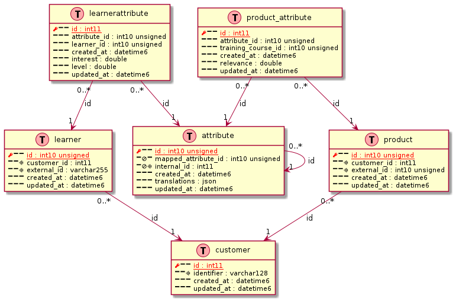

# The commands

- [1. Build tools](#1-build-tools)
  - [1.1. bin/install](#11-bininstall)
  - [1.2. bin/installRequirements](#12-bininstallrequirements)
  - [1.3. bin/waitForIt](#13-binwaitforit)
  - [1.4. bin/waitForMysql](#14-binwaitformysql)
  - [1.5. bin/doc](#15-bindoc)
- [2. Converter and Generator tools](#2-converter-and-generator-tools)
  - [2.1. bin/mysql2puml](#21-binmysql2puml)
    - [2.1.1. Help](#211-help)
    - [2.1.2. Example](#212-example)
- [3. Git tools](#3-git-tools)
  - [3.1. bin/gitIsAncestorOf](#31-bingitisancestorof)
  - [3.2. bin/gitIsBranch](#32-bingitisbranch)
  - [3.3. bin/gitRenameBranch](#33-bingitrenamebranch)
  - [3.4. bin/upgradeGithubRelease](#34-binupgradegithubrelease)
- [4. Dev tools](#4-dev-tools)
  - [4.1. bin/cli](#41-bincli)
    - [4.1.1. Help](#411-help)
    - [4.1.2. Example 1: open bash on a container named web](#412-example-1-open-bash-on-a-container-named-web)
    - [4.1.3. Example 2: connect to mysql container with root user](#413-example-2-connect-to-mysql-container-with-root-user)
    - [4.1.4. Example 3: connect to mysql server in order to execute a query](#414-example-3-connect-to-mysql-server-in-order-to-execute-a-query)
    - [4.1.5. Example 4: pipe sql command to mysql container](#415-example-4-pipe-sql-command-to-mysql-container)
  - [4.2. bin/postmanCli](#42-binpostmancli)
    - [4.2.1. Help](#421-help)
- [5. Database tools](#5-database-tools)
  - [5.1. bin/dbQueryAllDatabases](#51-bindbqueryalldatabases)
    - [5.1.1. Help](#511-help)
  - [5.2. bin/dbScriptAllDatabases](#52-bindbscriptalldatabases)
    - [5.2.1. Help](#521-help)
  - [5.3. bin/dbImport](#53-bindbimport)
    - [5.3.1. Help](#531-help)
  - [5.4. bin/dbImportProfile](#54-bindbimportprofile)
    - [5.4.1. Help](#541-help)
  - [5.5. bin/dbImportStream](#55-bindbimportstream)

## 1. Build tools

### 1.1. bin/install

```text
@@@install_help@@@
```

### 1.2. bin/installRequirements

```text
@@@installRequirements_help@@@
```

### 1.3. bin/waitForIt

```text
@@@waitForIt_help@@@
```

### 1.4. bin/waitForMysql

```text
@@@waitForMysql_help@@@
```

### 1.5. bin/doc

```text
@@@doc_help@@@
```

## 2. Converter and Generator tools

### 2.1. bin/mysql2puml

#### 2.1.1. Help

```text
@@@mysql2puml_help@@@
```

#### 2.1.2. Example

Mysql dump of some tables

```bash
mysqldump --skip-add-drop-table --skip-add-locks \
  --skip-disable-keys --skip-set-charset \
  --host=127.0.0.1 --port=3345 --user=root --password=root \
  --no-data skills \
  $(mysql --host=127.0.0.1 --port=3345 --user=root --password=root skills \
    -Bse "show tables like 'core\_%'") |
  grep -v '^\/\*![0-9]\{5\}.*\/;$' >doc/schema.sql
```

Transform mysql dump to plant uml format

```bash
mysql2puml \
  src/_binaries/Converters/testsData/mysql2puml.dump.sql \
  -s default >src/_binaries/Converters/testsData/mysql2puml.dump.puml
```

Plantuml diagram generated

```plantuml
@@@mysql2puml_plantuml_diagram@@@
```

using plantuml software, here an example of resulting diagram



## 3. Git tools

### 3.1. bin/gitIsAncestorOf

```text
@@@gitIsAncestorOf_help@@@
```

### 3.2. bin/gitIsBranch

```text
@@@gitIsBranch_help@@@
```

### 3.3. bin/gitRenameBranch

```text
@@@gitRenameBranch_help@@@
```

### 3.4. bin/upgradeGithubRelease

```text
@@@upgradeGithubRelease_help@@@
```

## 4. Dev tools

### 4.1. bin/cli

#### 4.1.1. Help

```text
@@@cli_help@@@
```

#### 4.1.2. Example 1: open bash on a container named web

```bash
cli web
```

will actually execute this command :

```bash
MSYS_NO_PATHCONV=1 MSYS2_ARG_CONV_EXCL='\*'
docker exec -it -e COLUMNS="$(tput cols)" -e LINES="$(tput lines)" --user=
apache2 //bin/bash
```

#### 4.1.3. Example 2: connect to mysql container with root user

```bash
cli mysql root bash
```

will actually execute this command :

```bash
MSYS_NO_PATHCONV=1 MSYS2_ARG_CONV_EXCL='\*'
docker exec -e COLUMNS="$(tput cols)" -e LINES="$(tput lines)" -it --user=root
project-mysql bash
```

#### 4.1.4. Example 3: connect to mysql server in order to execute a query

will actually execute this command :

```bash
MSYS_NO_PATHCONV=1 MSYS2_ARG_CONV_EXCL='\*'
docker exec -it -e COLUMNS="$(tput cols)" -e LINES="$(tput lines)" --user=mysql
project-mysql //bin/bash -c 'mysql -h127.0.0.1 -uroot -proot -P3306'
```

#### 4.1.5. Example 4: pipe sql command to mysql container

```bash
echo 'SELECT
  table_schema AS "Database",
  ROUND(SUM(data_length + index_length) / 1024 / 1024, 2) AS "Size (MB)"
FROM information_schema.TABLES' | bin/cli mysql
```

will actually execute this command :

```bash
MSYS_NO_PATHCONV=1 MSYS2_ARG_CONV_EXCL='\*'
docker exec -i -e COLUMNS="$(tput cols)" -e LINES="$(tput lines)" --user=mysql
project-mysql //bin/bash -c 'mysql -h127.0.0.1 -uroot -proot -P3306'
```

notice that as input is given to the command, tty option is not provided to
docker exec

### 4.2. bin/postmanCli

#### 4.2.1. Help

```text
@@@postmanCli_help@@@
```

## 5. Database tools

### 5.1. bin/dbQueryAllDatabases

Execute a query on multiple database in order to generate a report, query can be
parallelized on multiple databases

```bash
bin/dbQueryAllDatabases -e localhost-root conf/dbQueries/databaseSize.sql
```

#### 5.1.1. Help

```text
@@@dbQueryAllDatabases_help@@@
```

### 5.2. bin/dbScriptAllDatabases

Allow to execute a script on each database of specified mysql server

```bash
bin/dbScriptAllDatabases -d localhost-root dbCheckStructOneDatabase
```

or specified db only

```bash
bin/dbScriptAllDatabases -d localhost-root dbCheckStructOneDatabase db
```

launch script in parallel on multiple db at once

```bash
bin/dbScriptAllDatabases --jobs 10 -d localhost-root dbCheckStructOneDatabase
```

#### 5.2.1. Help

```text
@@@dbScriptAllDatabases_help@@@
```

### 5.3. bin/dbImport

Import default source dsn/db ExampleDbName into default target dsn/db
ExampleDbName

```bash
dbImport ExampleDbName
```

Ability to import db from dump stored on aws the dump file should have this name
`<fromDbName>.tar.gz` and stored on AWS location defined by S3_BASE_URL env
variable (see src/\_binaries/DbImport/testsData/.env file)

```bash
dbImport --from-aws ExampleDbName.tar.gz
```

It allows also to dump from source database and import it into target database.
Providing --profile option **dumps** only the tables selected. Providing
--tables option **imports** only the tables selected.

The following command will dump full structure and data of fromDb but will
insert only the data from tableA and tableB, full structure will be inserted
too. Second call to this command skip the dump as dump has been saved the first
time. Note that table A and table B are truncated on target database before
being imported.

```bash
dbImport --from-dsn default.remote --target-dsn default.local -p all \
  fromDb targetDB --tables tableA,tableB
```

#### 5.3.1. Help

```text
@@@dbImport_help@@@
```

### 5.4. bin/dbImportProfile

Import remote db into local db

```bash
dbImportProfile --from-dsn default.local MY_DB --ratio 45
```

Ability to generate profile that can be used in dbImport to filter out tables
bigger than given ratio (based on biggest table size). Profile is automatically
saved in ${HOME}/.bash-tools/dbImportProfiles with this format `auto*<dsn>*<db>`
**eg:** auto_default.local_MY_DB

#### 5.4.1. Help

```text
@@@dbImportProfile_help@@@
```

### 5.5. bin/dbImportStream

```text
@@@dbImportStream_help@@@
```
