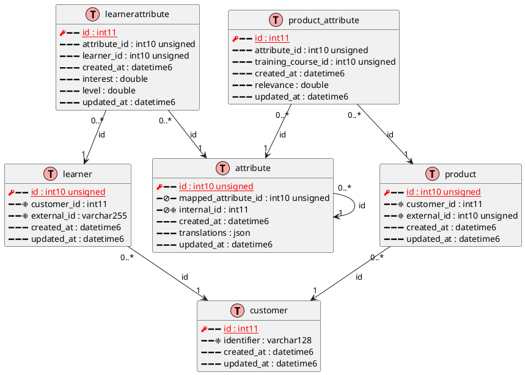

# bash-tools

Build status: [](https://travis-ci.com/fchastanet/bash-tools)
[](http://opensource.box.com/badges)
[](https://deepsource.io/gh/fchastanet/bash-tools/?ref=repository-badge)
[](https://deepsource.io/gh/fchastanet/bash-tools/?ref=repository-badge)
[](http://isitmaintained.com/project/fchastanet/bash-tools "Average time to resolve an issue")
[](http://isitmaintained.com/project/fchastanet/bash-tools "Percentage of issues still open")

- [1. Exerpt](#1-exerpt)
- [2. Installation/Configuration](#2-installationconfiguration)
- [3. The tools](#3-the-tools)
  - [3.1. bin/gitRenameBranch](#31-bingitrenamebranch)
  - [3.2. bin/dbQueryAllDatabases](#32-bindbqueryalldatabases)
  - [3.3. bin/dbScriptAllDatabases](#33-bindbscriptalldatabases)
  - [3.4. bin/dbImport](#34-bindbimport)
  - [3.5. bin/dbImportProfile](#35-bindbimportprofile)
  - [3.6. bin/cli](#36-bincli)
  - [3.7. bin/gitIsAncestorOf](#37-bingitisancestorof)
  - [3.8. bin/mysql2puml](#38-binmysql2puml)
- [4. Bash Framework](#4-bash-framework)
  - [4.1. UT](#41-ut)
  - [4.2. auto generated bash doc](#42-auto-generated-bash-doc)
- [5. Acknowledgements](#5-acknowledgements)

## 1. Exerpt

This is a collection of several bash tools using a bash framework allowing to easily import bash script, log, display log messages, database manipulation, user interation, version comparison, ...

List of tools:
* **gitRenameBranch** : easy rename git local branch, use options to push new branch and delete old branch
* **cli** : easy connection to docker container
* **dbImport** : Import db from aws dump or mysql into target db
* **dbImportTable** : Import remote db table from aws or mysql into target db
* **dbQueryAllDatabases** : Execute a query on multiple database in order to generate a report, query can be parallelized on multiple databases
* **dbScriptAllDatabases** : same as dbQueryAllDatabases but you can execute an arbitrary script on each database
* **gitIsAncestor** : show an error if commit is not an ancestor of branch
* **gitIsBranch** : show an error if branchName is not a known branch
* **gitRenameBranch** : rename git local branch, use options to push new branch and delete old branch
* **waitforIt** : useful in docker container to know if another container port is accessible
* **waitForMysql** : useful in docker container to know if mysql server is ready to receive queries

## 2. Installation/Configuration

clone this repository and create configuration files in your home directory
alternatively you can use the **install.sh** script
```bash
git clone git@github.com:fchastanet/bash-tools.git
cd bash-tools
./install.sh
```

The following structure will be created in your home directory
<pre>
~/.bash-tools/
├── cliProfiles
│   ├── default.sh
│   ├── mysql.remote.sh
│   ├── mysql.sh
├── dbImportDumps
├── dbImportProfiles
│   ├── all.sh
│   ├── default.sh
│   ├── none.sh
├── dbQueries
│   └── databaseSize.sql
├── dsn
│   └── default.local.env
│   └── default.remote.env
│   └── localhost-root.env
└── .env
</pre>

Some tools need [GNU parallel software](https://www.gnu.org/software/parallel/), it allows running multiple processes in parallel. You can install it running
```bash
sudo apt update
sudo apt install -y parallel
# remove parallel nagware
mkdir ~/.parallel
touch ~/.parallel/will-cite
```

## 3. The tools

### 3.1. bin/gitRenameBranch

**Help**
```
Description: rename git local branch, use options to push new branch and delete old branch

Usage: gitRenameBranch [-h|--help] prints this help and exits
Usage: gitRenameBranch <newBranchName> [<oldBranchName>] [--push|-p] [--delete|-d] [--assume-yes|-yes|-y]
    --help,-h prints this help and exits
     -y, --yes, --assume-yes do not ask for confirmation (use with caution)
        Automatic yes to prompts; assume "y" as answer to all prompts
        and run non-interactively. 
    --push,-p push new branch
    --delete,-d delete old remote branch
    <newBranchName> the new branch name to give to current branch
    <oldBranchName> (optional) the name of the old branch if not current one
```

### 3.2. bin/dbQueryAllDatabases

Execute a query on multiple database in order to generate a report, query can be parallelized on multiple databases
```bash
bin/dbQueryAllDatabases -e localhost-root conf/dbQueries/databaseSize.sql
```

**Help**
```
Description: Execute a query on multiple databases in order to generate a report with tsv format, query can be parallelized on multiple databases

Usage: dbQueryAllDatabases [-h|--help] prints this help and exits
Usage: dbQueryAllDatabases <query|queryFile> [-d|--dsn <dsn>] [-q|--query] [--jobs|-j <jobsCount>] [--bar|-b]

    -q|--query            implies <query> parameter is a mysql query string
    -d|--dsn <dsn>        to use for target mysql server (Default: default.local) 
    -j|--jobs <jobsCount> specify the number of db to query in parallel (this needs the use of gnu parallel)
    -b|--bar              Show progress as a progress bar. In the bar is shown: % of jobs completed, estimated seconds left, and number of jobs started.
    <query|queryFile>
        if -q option is provided this parameter is a mysql query string
        else a file must be specified

List of available dsn:
       - default.local
       - default.remote
       - localhost-root
List of available queries (default dir /bash/conf/dbQueries overridable in home dir /home/www-data/.bash-tools/dbQueries):
       - databaseSize
```

### 3.3. bin/dbScriptAllDatabases
Allow to execute a script on each database of specified mysql server
```bash
bin/dbScriptAllDatabases -d localhost-root dbCheckStructOneDatabase
```

or specified db only
```bash
bin/dbScriptAllDatabases -d localhost-root dbCheckStructOneDatabase db
```

launch script in parallel on multiple db at once
```bash
bin/dbScriptAllDatabases --jobs 10 -d localhost-root dbCheckStructOneDatabase
```

**Help:**
```
Description: Allows to execute a script on each database of specified mysql server

Usage: dbScriptAllDatabases [-h|--help] prints this help and exits
Usage: dbScriptAllDatabases [-j|--jobs <numberOfJobs>] [-o|--output <outputDirectory>] [-d|--dsn <dsn>] [-v|--verbose] [-l|--log-format <logFormat>] [--database <dbName>] <scriptToExecute> [optional parameters to pass to the script]
    <scriptToExecute>             the script that will be executed on each databases
    -d|--dsn <dsn>                target mysql server (Default: default.local) 
    --database <dbName>           if provided will check only this db, otherwise script will be executed on all dbs of mysql server
    -j|--jobs <numberOfJobs>      the number of db to query in parallel (default: 1)
    -o|--output <outputDirectory> output directory, see log-format option (default : "/home/www-data/.bash-tools/output")
    -l|--log-format <logFormat>   if log provided, will log each db result to log file, can be one of these values (none, log) (default: none)
    -v|--verbose                  display more information

Note: the use of output, log-format, verbose options highly depends on the script used

Example: script conf/dbScripts/extractData.sh 
    executes query databaseSize (see conf/dbQueries/databaseSize.sql) on each db and log the result in log file in default output dir, call it using
    /bash/bin/dbScriptAllDatabases -j 10 extractData databaseSize

    executes query databaseSize on each db and display the result on stdout (2>/dev/null hides information messages)
    /bash/bin/dbScriptAllDatabases -j 10 --log-format none extractData databaseSize 

    use --verbose to get some debug information
    /bash/bin/dbScriptAllDatabases -j 10 --log-format none --verbose extractData databaseSize 

Use cases:
    you can use this script in order to check that each db model conforms with your ORM schema
    simply create a new script in conf/dbQueries that will call your orm schema checker

    update multiple db at once (simple to complex update script)

List of available dsn:
       - default.local
       - default.remote
       - localhost-root
list of available scripts (/home/www-data/.bash-tools/conf/dbScripts):
       - extractData
```

### 3.4. bin/dbImport
Import default source dsn/db ExampleDbName into default target dsn/db ExampleDbName
```bash
dbImport ExampleDbName
```

Ability to import db from dump stored on aws
the dump file should have this name `<fromDbName>.tar.gz`
and stored on AWS location defined by S3_BASE_URL env variable (see conf/.env file)

```bash
dbImport --from-aws ExampleDbName.tar.gz
```

It allows also to dump from source database and import it into target database.
Providing --profile option **dumps** only the tables selected.
Providing --tables option **imports** only the tables selected.

The following command will dump full structure and data of fromDb but will insert only the data from 
tableA and tableB, full structure will be inserted too. Second call to this command skip the dump 
as dump has been saved the first time.
Note that table A and table B are truncated on target database before being imported.
```bash
dbImport --from-dsn default.remote --target-dsn default.local -p all fromDb targetDB --tables tableA,tableB
```

**Help**
```
Description: Import source db into target db

Usage: dbImport --help prints this help and exits
Usage: dbImport <fromDbName> [<targetDbName>] 
Usage: dbImport -a|--from-aws <fromDbS3Filename> [<targetDbName>] 
                        [-a|--from-aws]
                        [-s|--skip-schema] [-p|--profile profileName] 
                        [-o|--collation-name utf8_general_ci] [-c|--character-set utf8]
                        [-t|--target-dsn dsn] [-f|--from-dsn dsn]
                        [--tables tableName1,tableName2]

    <fromDbS3Filename>         If option -a is provided
        remoteDBName will represent the name of the s3 file
        Only .gz or tar.gz file are supported
    <fromDbName>               the name of the source/remote database
    <targetDbName>             the name of the target database, use fromDbName(without extension) if not provided
    -s|--skip-schema            avoid to import the schema
    -o|--collation-name         change the collation name used during database creation 
        (default value: collation name used by remote db)
    -c|--character-set          change the character set used during database creation 
        (default value: character set used by remote db or dump file if aws)
    -p|--profile profileName    the name of the profile to use in order to include or exclude tables
        (if not specified /home/www-data/.bash-tools/dbImportProfiles/default.sh is used if exists otherwise /bash/conf/dbImportProfiles/default.sh)
    -t|--target-dsn dsn         dsn to use for target database (Default: default.local) 
    -f|--from-dsn dsn           dsn to use for source database (Default: default.remote)
        this option is incompatible with -a|--from-aws option
    -a|--from-aws               db dump will be downloaded from s3 instead of using remote db, 
        remoteDBName will represent the name of the file
        profile will be calculated against the dump itself
        this option is incompatible with -f|--from-dsn option
    --tables table1,table2      import only table specified in the list
        if aws mode, ignore profile option

    Aws s3 location       : s3://example.com/exports/

List of available profiles (default profiles dir /bash/conf/dbImportProfiles overridable in home profiles /home/www-data/.bash-tools/dbImportProfiles):
       - all
       - default
       - none
List of available dsn:
       - default.local
       - default.remote
       - localhost-root
```

### 3.5. bin/dbImportProfile
Import remote db into local db
```bash
dbImportProfile --from-dsn default.local MY_DB --ratio 45
```

Ability to generate profile that can be used in dbImport to filter out tables bigger than given ratio (based on biggest table size).
Profile is automatically saved in ${HOME}/.bash-tools/dbImportProfiles with this format 'auto_<dsn>_<db>'
**eg:** auto_default.local_MY_DB

**Help**
```
Description: generate optimized profiles to be used by dbImport

Usage: dbImportProfile --help prints this help and exits
Usage: dbImportProfile <fromDbName> 
                        [-p|--profile profileName] 
                        [-f|--from-dsn dsn]

    <fromDbName>                the name of the source/remote database
    -p|--profile profileName    the name of the profile to write in /home/www-data/.bash-tools/dbImportProfiles directory
        if not provided, the file name pattern will be 'auto_<dsn>_<fromDbName>.sh'
    -f|--from-dsn dsn           dsn to use for source database (Default: default.remote)
    -r|--ratio ratio            define the ratio to use (0 to 100% - default 70)
        0 means profile will filter out all the tables
        100 means profile will keep all the tables
        eg: 70 means that table size (table+index) > 70%*max table size will be excluded

List of available profiles (default profiles dir /bash/conf/dbImportProfiles overridable in home profiles /home/www-data/.bash-tools/dbImportProfiles):
       - all
       - default
       - none
List of available dsn:
       - default.local
       - default.remote
       - localhost-root
```

### 3.6. bin/cli

**Help**
```
Description: easy connection to docker container

Usage: cli [-h|--help] prints this help and exits
Usage: cli [<container>] [user] [command]

    <container> : container should be one of these values (provided by 'docker ps'): 
        
        if not provided, it will load the container specified in default configuration (project-apache2)

examples:
    to connect to mysql container in bash mode with user mysql
        cli mysql mysql "//bin/bash"
    to connect to web container with user root
        cli web root

you can override these mappings by providing your own profile in 
    
This script will be executed with the variables userArg containerArg commandArg set as specified in command line
and should provide value for the following variables finalUserArg finalContainerArg finalCommandArg

List of available profiles (from /bash/conf/cliProfiles and overridable in /home/www-data/.bash-tools/cliProfiles):
       - default
       - mysql
       - mysql.remote
       - node
       - redis
       - web
```

easy connection to docker container

**Example 1: open bash on a container named web**
```bash
cli web
```
will actually execute this command : MSYS_NO_PATHCONV=1 MSYS2_ARG_CONV_EXCL='*' docker exec -it -e COLUMNS="$(tput cols)" -e LINES="$(tput lines)" --user= apache2 //bin/bash

**Example 2: connect to mysql container with root user**
```bash
cli mysql root bash
```
will actually execute this command : MSYS_NO_PATHCONV=1 MSYS2_ARG_CONV_EXCL='*' docker exec -e COLUMNS="$(tput cols)" -e LINES="$(tput lines)" -it --user=root project-mysql bash

**Example 3: connect to mysql server in order to execute a query**

will actually execute this command : MSYS_NO_PATHCONV=1 MSYS2_ARG_CONV_EXCL='*' docker exec -it -e COLUMNS="$(tput cols)" -e LINES="$(tput lines)" --user=mysql project-mysql //bin/bash -c 'mysql -h127.0.0.1 -uroot -proot -P3306'

**Example 4: pipe sql command to mysql container** 
```bash
echo 'SELECT table_schema AS "Database",ROUND(SUM(data_length + index_length) / 1024 / 1024, 2) AS "Size (MB)" FROM information_schema.TABLES' | bin/cli mysql
```
will actually execute this command : MSYS_NO_PATHCONV=1 MSYS2_ARG_CONV_EXCL='*' docker exec -i -e COLUMNS="$(tput cols)" -e LINES="$(tput lines)" --user=mysql project-mysql //bin/bash -c 'mysql -h127.0.0.1 -uroot -proot -P3306'
notice that as input is given to the command, tty option is not provided to docker exec

### 3.7. bin/gitIsAncestorOf

**Help**
```
Usage: gitIsAncestorOf <branch> <commit>
show an error if commit is not an ancestor of branch
```

### 3.8. bin/mysql2puml

**Help**
```
Description: convert mysql dump sql schema to plantuml format

Usage: mysql2puml [-h|--help] prints this help and exits
Usage: mysql2puml [-v|--version] prints the version and exits
Usage: mysql2puml [-s|--skin skin] inputSqlFile

  --help,-h      : prints this help and exits
  --version,-v   : display version and exit
  --skin,-s skin : (optional) header configuration of the plant uml file (default: default)
  inputSqlFile   : sql filepath to parse
  
Examples
mysql2puml dump.dql

mysqldump --skip-add-drop-table --skip-add-locks --skip-disable-keys --skip-set-charset --user=root --password=root --no-data skills | mysql2puml

List of available skins:
       - default

```

Mysql dump of some tables

```bash
mysqldump --skip-add-drop-table --skip-add-locks --skip-disable-keys --skip-set-charset   --host=127.0.0.1 --port=3345 --user=root --password=root --no-data skills  $(mysql --host=127.0.0.1 --port=3345 --user=root --password=root skills -Bse "show tables like 'core\_%'") | grep -v '^\/\*![0-9]\{5\}.*\/;$' > doc/schema.sql
```

Transform mysql dump to plant uml format

```bash
mysql2puml tests/tools/data/mysql2puml.dump.sql -s default > tests/tools/data/mysql2puml.puml
```

Plantuml diagram generated



using plantuml software, here an example of resulting diagram


## 4. Bash Framework

All these tools are based on *Bash framework* with the following features:
 * A boostrap that allows to import automatically .env file in home folder or ~/.bash-tools folder in order to load some environment variables
 * **import alias** allows to import (only once) a bash file found in following folders (in order)
    * vendor/bash-framework
    * vendor
    * calling script path
    * absolute path 
  * **source alias**, same as import but multiple times import allowed
  * Framework
    * **Framework::expectUser** exits with message if current user is not the expected one
    * **Framework::expectNonRootUser** exits with message if current user is root
  * Database
    * **Database::dump** dump db limited to optional table list
    * **Database::query** mysql query on a given db
    * **Database::dropTable** drop table if exists
    * **Database::dropDb** drop database if exists
    * **Database::createDb** create database if not already existing
    * **Database::isTableExists** check if table exists on given db
    * **Database::ifDbExists** check if given database exists
    * all these methods need to call **Database::newInstance** in order to reference target db connection
  * Array
    * **Array::contains** check if an element is contained in an array
  * Functions
    * **Functions::checkCommandExists** check if command specified exists or exits with error message if not
    * **Functions::isWindows** determine if the script is executed under windows (git bash, wsl)
    * **Functions::quote** quote a string replace ' with \'
    * **Functions::addTrap** add a trap to existing trap or simply set the trap if no existing trap
  * UI
    * **UI::askToContinue** ask the user if he wishes to continue a process
    * **UI::askYesNo** ask the user a confirmation
    * **UI::askToIgnoreOverwriteAbort** ask the user to ignore(i), overwrite(o) or abort(a)
  * Version
    * **Version::checkMinimal** ensure that command exists with expected version
    * **Version::compare** compares two versions
  * Log::display* output colored message on error output and log the message 
    * **Log::fatal** error message in red bold and exits with code 1
    * **Log::displayError** error message in red
    * **Log::displayWarning** warning message  in yellow
    * **Log::displayInfo** info message in white on lightBlue
    * **Log::displaySuccess** success message in green
    * **Log::displayDebug** debug message in grey
  * Log::log* output message in a log file
    * **Log::logError**
    * **Log::logWarning**
    * **Log::logInfo**
    * **Log::logSuccess**
    * **Log::logDebug**


**Usage:** simply add these lines to your script
```bash
#!/usr/bin/env bash

# load bash-framework
# shellcheck source=bash-framework/_bootstrap.sh
CURRENT_DIR=$( cd "$( dirname "${BASH_SOURCE[0]}" )" && pwd )
source "$( cd "${CURRENT_DIR}/.." && pwd )/bash-framework/_bootstrap.sh"

# bash framework is loaded, .env has been loaded (default .env file present in bash-framework is loaded if none exists yet) 

# exits with message if this script is executed using root user
Framework::expectNonRootUser

# import some useful apis
import bash-framework/Database
import bash-framework/Array
```

### 4.1. UT
All the methods of this framework are unit tested, you can run the unit tests using the following command
```bash
./test.sh
```

### 4.2. auto generated bash doc

generated by running
```bash
./doc.sh
```

* [bash-framework/Constants.sh](doc/Constants.md)
* [bash-framework/Database.sh](doc/Database.md)
* [bash-framework/Framework.sh](doc/Framework.md)
* [bash-framework/File.sh](doc/File.md)
* [bash-framework/Array.sh](doc/Array.md)
* [bash-framework/Functions.sh](doc/Functions.md)
* [bash-framework/Git.sh](doc/Git.md)
* [bash-framework/UI.sh](doc/UI.md)
* [bash-framework/Version.sh](doc/Version.md)
* [bash-framework/Log.sh](doc/Log.md)

## 5. Acknowledgements
Like so many projects, this effort has roots in many places. 

I would like to thank particularly  Bazyli Brzóska for his work on the project [Bash Infinity](https://github.com/niieani/bash-oo-framework).
Framework part of this project is largely inspired by his work(some parts copied). You can see his [blog](https://invent.life/project/bash-infinity-framework) too that is really interesting 